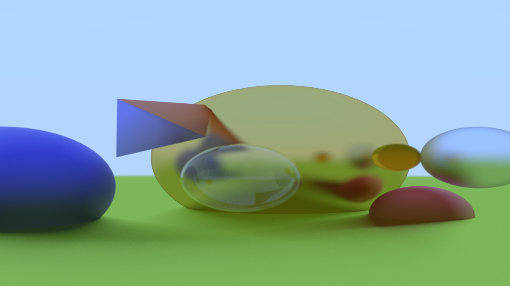

# Rustyscene

A toy brute force path tracer written in Rust following the tutorial [Ray Tracing in one weekend](https://raytracing.github.io/).

Features two basic primitive shapes:
- `Sphere`
- `Triangle`

along with three different material types:
- `Diffuse`
- `Metallic`
- `Dielectric`


## Example 

```rust

fn main() {

    let width = 500;
    let height = 500;
    let options = RenderOptions { samples: 256, max_bounces: 100 };

    let camera = Camera::new(
        Vector::new(-0.5, 0.0, 3.0),
        Vector::new(1.2, 0.3, -4.0),    // Focal point
        Direction::new(0.0, 1.0, 0.0),
        50.0,
        (width / height) as f64,
        1.0 / 12.0,
    );

    let red_color = Color::new(0.7, 0.3, 0.3);
    let yellow_color = Color::new(0.8, 0.6, 0.1);
    let white_color = Color::new(1.0, 1.0, 1.0);
    let green_color = Color::new(0.6, 0.8, 0.2);

    let red_diffuse_material = Material::Diffuse(Diffuse { color: red_color });
    let blue_diffuse_material = Material::Diffuse(Diffuse { color: Color::new(0.3, 0.3, 0.8) });
    let blue_metallic_material = Material::Metal(Metal { albedo: Color::new(0.8, 0.8, 0.95), fuzz: 0.7 });
    let yellow_metallic_material = Material::Metal(Metal { albedo: Color::new(0.8, 0.6, 0.2), fuzz: 0.2 });
    let dielectric_material = Material::Dielectric(Dielectric { albedo: white_color, refraction_index: 1.5 });
    let yellow_dielectric_material = Material::Dielectric(Dielectric { albedo: yellow_color, refraction_index: 1.1 });


    let objects: Scene = vec![
        ObjectTypes::new_sphere( Point::new(0.0, -601.0, -1.0), 600.0, Material::Diffuse(Diffuse { color: green_color })),
        ObjectTypes::new_sphere( Point::new(-1.4, -0.5, -3.0), 1.0,  blue_diffuse_material.clone()),

        // Hollow Bubble
        ObjectTypes::new_sphere( Point::new(0.6, -0.3, -2.0), 0.5,  dielectric_material.clone() ),
        ObjectTypes::new_sphere( Point::new(0.6, -0.3, -2.0), -0.495, dielectric_material.clone() ),

        ObjectTypes::new_sphere( Point::new(1.8, 0.0, -1.6), 0.2,  yellow_dielectric_material.clone() ),
        ObjectTypes::new_sphere(Point::new(1.5, 0.0, -4.0), 1.5, yellow_metallic_material.clone() ),
        ObjectTypes::new_sphere( Point::new(2.5, -1.0, -2.5), 0.5,  red_diffuse_material.clone() ),
        ObjectTypes::new_sphere(Point::new(2.8, 0.0, -2.0), 0.5, blue_metallic_material.clone() ),

        ObjectTypes::new_triangle(Point::new(-0.4, 0.0, -3.0), Point::new(-0.4, 1.0, -3.0), Point::new(0.3, 0.3, -2.0), blue_diffuse_material.clone()),
        ObjectTypes::new_triangle(Point::new(-0.4, 1.0, -3.0), Point::new(0.6, 1.0, -3.5), Point::new(0.3, 0.3, -2.0), red_diffuse_material.clone()),
    ];

    let mut img = RgbImage::new(width, height);

    println!("Raytracing");
    raytrace(camera, &objects, options, &mut img);
    println!("Saving image to file");
    img.save("../samples/output.png");
}

```




